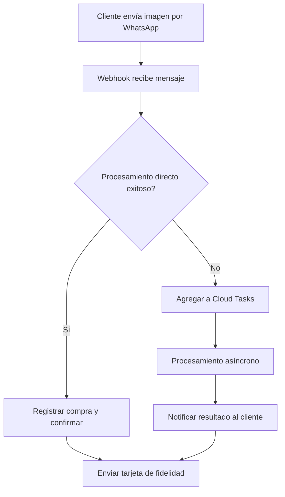

# Virtual Loyalty Card - Firebase Functions

## Descripción General

Esta aplicación implementa un sistema de tarjetas de fidelización virtuales que permite a los negocios gestionar programas de recompensas digitales. Los clientes pueden acumular puntos enviando fotos de sus comprobantes de compra a través de WhatsApp, eliminando la necesidad de tarjetas físicas.

## Tecnologías Utilizadas

- **Runtime**: Node.js 22
- **Firebase Functions v2**: Para el backend serverless
- **Google Cloud Vision API**: Para OCR y extracción de texto de comprobantes
- **WhatsApp Business API**: Para comunicación con clientes
- **Google Cloud Tasks**: Para procesamiento asíncrono de imágenes
- **MercadoPago API**: Para procesamiento de pagos
- **Firebase Storage**: Para almacenamiento de imágenes de comprobantes
- **Firebase Firestore**: Base de datos NoSQL

## Arquitectura del Sistema

### Funciones Principales

1. **processWhatsAppAPI** - Webhook principal para mensajes de WhatsApp
2. **processImageTask** - Procesamiento asíncrono de imágenes vía Cloud Tasks
3. **processImageQueue** - Procesador programado para cola de imágenes
4. **createPreference** - Integración con MercadoPago para pagos
5. **cleanupImagesScheduled** - Limpieza automática de imágenes antiguas

### Flujo de Procesamiento de Comprobantes



## Estructura de Firestore

### Colección: `businesses`

Almacena información de los negocios registrados.

```javascript
{
  "business-slug": {
    name: "Nombre del Negocio",
    businessName: "RAZON SOCIAL COMPLETA",
    ruc: "20123456789",
    slug: "business-slug",
    address: "Dirección completa",
    city: "Ciudad",
    active: true,
    config: {
      purchasesRequired: 10,        // Compras necesarias para premio
      timeLimit: 30,                // Minutos entre compras
      expirationDays: 90,           // Días de expiración
      minAmount: 10.00,             // Monto mínimo para registrar
      icon: "🛍️",
      backgroundColor: "#F5A623",
      reward: "Descripción del premio",
      rewards: [                    // Premios escalonados
        {
          consumptions: 5,
          reward: "Premio intermedio"
        },
        {
          consumptions: 10,
          reward: "Premio principal"
        }
      ]
    },
    createdAt: Timestamp,
    updatedAt: Timestamp
  }
}
```

### Colección: `customers`

Perfil y actividad de los clientes en todos los negocios.

```javascript
{
  "+51987654321": {                // phoneNumber como ID
    profile: {
      phoneNumber: "+51987654321",
      name: "Nombre del Cliente",
      createdAt: Timestamp,
      lastActive: Timestamp
    },
    businesses: {
      "business-slug": {
        firstVisit: Date,
        lastVisit: Date,
        purchaseCount: 15,
        totalSpent: 450.50,
        purchases: [
          {
            amount: 25.50,
            date: Date,
            receiptUrl: "gs://bucket/path/image.jpg",
            verified: true,
            invoiceNumber: "F001-123456",
            ruc: "20123456789",
            address: "Dirección del local",
            businessName: "RAZON SOCIAL",
            usedForRedemption: false    // Para control de redenciones
          }
        ]
      }
    }
  }
}
```

### Colección: `customer_businesses`

Vista optimizada de negocios por cliente (nueva estructura con subcolecciones).

```javascript
// Ruta: customer_businesses/{phoneNumber}/businesses/{businessSlug}
{
  businessSlug: "business-slug",
  businessName: "Nombre del Negocio",
  totalSpent: 450.50,
  purchaseCount: 15,
  firstVisit: Timestamp,
  lastVisit: Timestamp,
  lastPurchase: {
    amount: 25.50,
    date: Timestamp,
    invoiceNumber: "F001-123456",
    ruc: "20123456789"
  },
  createdAt: Timestamp
}
```

### Colección: `customer_purchases`

Historial de compras individuales por cliente (nueva estructura con subcolecciones).

```javascript
// Ruta: customer_purchases/{phoneNumber}/purchases/{purchaseId}
{
  id: "20123456789-F001-123456",        // RUC-InvoiceNumber o ID único
  businessSlug: "business-slug",
  businessName: "Nombre del Negocio",
  amount: 25.50,
  date: Timestamp,
  receiptUrl: "gs://bucket/path/image.jpg",
  verified: true,
  invoiceNumber: "F001-123456",
  ruc: "20123456789",
  address: "Dirección del local",
  usedForRedemption: false,           // Para control de redenciones
  
  // Campos adicionales opcionales
  vendor: "Nombre del vendedor",
  items: [{ quantity: 2, description: "Café", unitPrice: 8.50 }],
  amountInWords: "VEINTICINCO CON 50/100 SOLES",
  
  // Metadatos
  migratedAt: Timestamp,              // Si fue migrado
  migratedFrom: "customers_collection" // Origen de migración
}
```

### Colección: `business_customers`

Vista optimizada de clientes por negocio para administradores.

```javascript
// Ruta: business_customers/{businessSlug}/customers/{phoneNumber}
{
  phoneNumber: "+51987654321",
  customerName: "Nombre del Cliente",
  businessSlug: "business-slug",
  userId: "firebase-auth-uid",          // Si tiene cuenta
  firstVisit: Timestamp,
  lastVisit: Timestamp,
  purchaseCount: 15,
  totalSpent: 450.50,
  lastPurchase: {
    amount: 25.50,
    timestamp: Timestamp,
    invoiceNumber: "F001-123456",
    ruc: "20123456789"
  },
  createdAt: Timestamp,
  updatedAt: Timestamp
}
```

### Colección: `business_invoices`

Registro detallado de compras por negocio.

```javascript
// Ruta: business_invoices/{businessSlug}/purchases/{purchaseId}
{
  id: "20123456789-F001-123456",        // RUC-InvoiceNumber
  phoneNumber: "+51987654321",
  customerName: "Nombre del Cliente",
  date: Timestamp,
  amount: 25.50,
  receiptUrl: "gs://bucket/path/image.jpg",
  verified: true,
  
  // Datos extraídos del comprobante
  invoiceNumber: "F001-123456",
  ruc: "20123456789",
  businessName: "RAZON SOCIAL COMPLETA",
  address: "Dirección del local",
  vendor: "Nombre del vendedor",
  amountInWords: "VEINTICINCO CON 50/100 SOLES",
  fullText: "Texto completo extraído por OCR",
  
  // Metadatos de procesamiento
  issueDate: "15/01/2025",             // Fecha del comprobante
  shareDate: Timestamp,                // Fecha de envío por WhatsApp
  items: [                             // Productos comprados
    {
      quantity: 2,
      description: "Café Americano",
      unitPrice: 8.50,
      subtotal: 17.00
    }
  ]
}
```

## Nuevas Estructuras Implementadas

He modificado tus funciones para que registren automáticamente los datos en las nuevas colecciones `customer_businesses` y `customer_purchases`, manteniendo también la estructura actual por compatibilidad.

### Cambios Realizados:

1. **firestoreService.js**: 
   - Función `registerPurchase` actualizada para escribir en ambas estructuras
   - Función `redeemReward` mejorada para manejar redenciones en ambas estructuras
   - Nuevas funciones: `getCustomerPurchases` y `getCustomerBusinesses`

2. **processImageTask.js**:
   - Actualizado para usar `getCustomerBusinesses` para verificación
   - Mantiene compatibilidad con el flujo existente

3. **queueProcessor.js**:
   - Función `processQueuedImage` completamente reescrita
   - Mejor manejo de errores y validaciones

### Script de Migración

He creado `src/utils/migrateToNewStructure.js` que permite migrar todos los datos existentes:

```bash
# Ejecutar migración
node src/utils/migrateToNewStructure.js
```

### Ventajas de las Nuevas Estructuras

1. **Escalabilidad**: Sin límites de 1MB por documento
2. **Performance**: Consultas específicas sin cargar datos innecesarios
3. **Concurrencia**: Actualizaciones simultáneas sin conflictos
4. **Mantenimiento**: Más fácil de mantener y optimizar

### Compatibilidad

- **Durante la transición**: Las funciones escriben en ambas estructuras
- **Consultas existentes**: Siguen funcionando con la estructura actual
- **Nuevas consultas**: Pueden usar las estructuras optimizadas

¿Te gustaría que proceda con algún aspecto específico o que ejecutemos el despliegue de las funciones actualizadas?